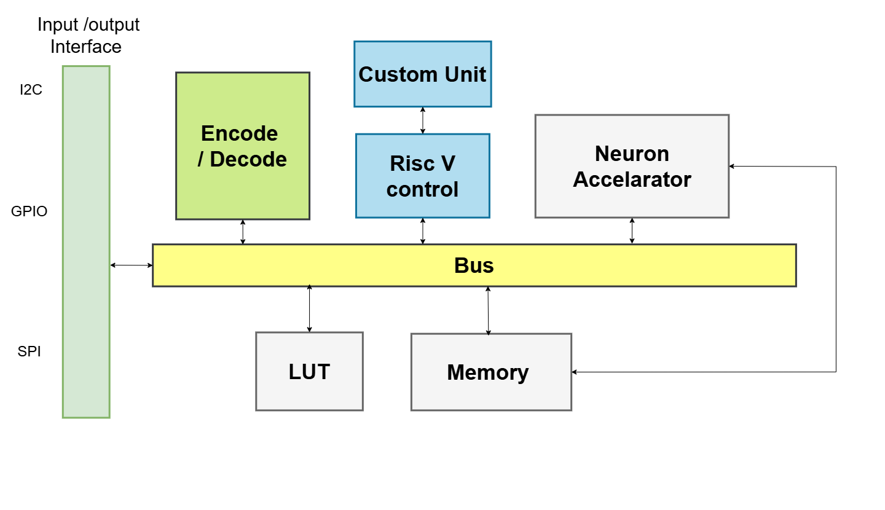
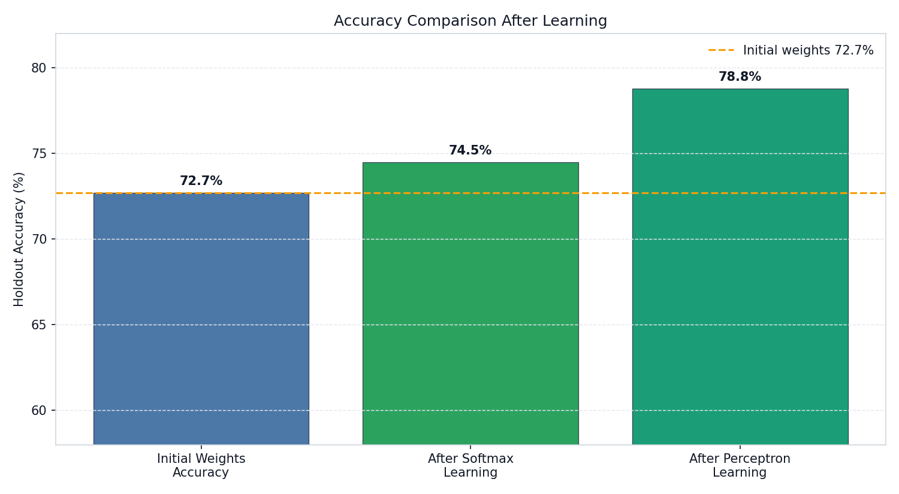
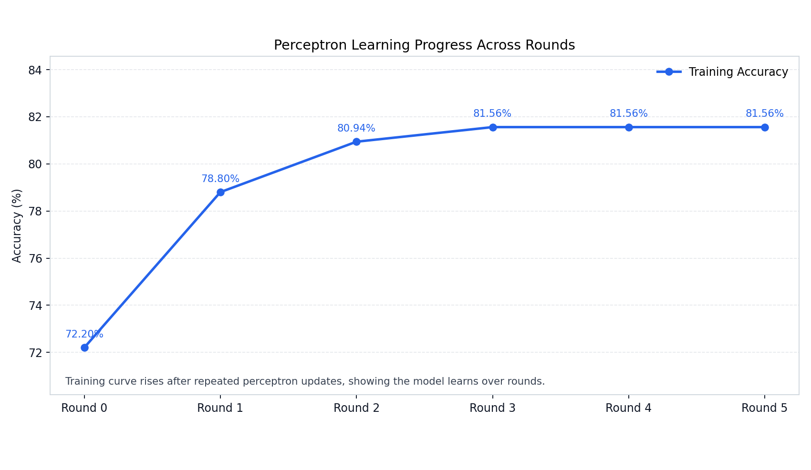

# On-Chip Offline Neuromorphic Computing

> **Final Year Project** — Department of Computer Engineering, University of Peradeniya, Sri Lanka

A full Spiking Neural Network (SNN) training and inference pipeline implemented entirely in hardware on an FPGA SoC. The system performs on-chip offline learning — once deployed, the chip runs inference, computes surrogate gradients, and executes backpropagation weight updates **without any host PC**.

---

## Team

| E-Number | Name | Email |
|----------|------|-------|
| E/20/346 | S.M.P.H. Samarakoon | [e20346@eng.pdn.ac.lk](mailto:e20346@eng.pdn.ac.lk) |
| E/20/419 | Wakkumbura M.M.S.S. | [e20419@eng.pdn.ac.lk](mailto:e20419@eng.pdn.ac.lk) |
| E/20/439 | Wickramasinghe J.M.W.G.R.L. | [e20439@eng.pdn.ac.lk](mailto:e20439@eng.pdn.ac.lk) |

## Supervisors

| Name | Email |
|------|-------|
| Dr. Isuru Nawinne | [isurun@eng.pdn.ac.lk](mailto:isurun@eng.pdn.ac.lk) |
| Prof. Roshan G. Ragel | [roshanr@eng.pdn.ac.lk](mailto:roshanr@eng.pdn.ac.lk) |

---

## Table of Contents

1. [Overview](#overview)
2. [System Architecture](#system-architecture)
3. [Key Features](#key-features)
4. [Benchmark Results](#benchmark-results)
5. [MNIST Accuracy](#mnist-accuracy)
6. [Project Structure](#project-structure)
7. [Getting Started](#getting-started)
8. [RTL Test Suite](#rtl-test-suite)
9. [Links](#links)

---

## Overview

Neuromorphic computing mimics biological neural computation using spike-based information encoding. This project demonstrates a complete **on-chip offline SNN training system** targeting MNIST handwritten digit classification (`784 → 200 → 10` neurons).

The system is implemented on a **RISC-V SoC** with a custom inference accelerator and is designed to run the entire learning loop — forward inference, gradient computation, and weight updates — autonomously in hardware.

**Application task:** MNIST digit classification
**Number format:** Q16.16 fixed-point (32-bit)
**On-chip bus:** Wishbone
**SoC framework:** LiteX / Migen

---

## System Architecture

The chip operates in three sequential states, orchestrated by the on-chip RISC-V CPU:



The SoC connects all major blocks — RISC-V control CPU, Custom Backprop Unit, Neuron Accelerator, Surrogate Gradient LUT, and Shared Memory — over a common Wishbone bus. External I/O (I2C, GPIO, SPI) is available via the Encode/Decode interface block.

### State Descriptions

| State | Name | Executor | Description |
|-------|------|----------|-------------|
| 1 | Inference | Hardware accelerator (RTL) | LIF neurons compute membrane potentials and spike outputs; results written to shared BRAM via dump FSM |
| 2 | Surrogate Substitution | RISC-V CPU firmware | CPU reads V_mem from BRAM, queries the surrogate gradient LUT (256-entry ROM), writes gradient back |
| 3 | Learning / Backprop | RISC-V CPU + custom ISA | CPU reads gradients and spike data, runs backpropagation using 6 hardware-accelerated custom instructions, updates weights |

### LIF Neuron Model

Each clock tick, each neuron:
1. Accumulates weighted input spikes into membrane potential `V_mem`
2. Fires (spike = 1) if `V_mem >= V_threshold`; `V_mem` resets on fire
3. Otherwise `V_mem` decays: `V_mem = V_mem × β`, where `β = 192/256 ≈ 0.75`

### Backpropagation Formula

```
δ  = ((error + 0.95 × δ_prev) × surrogate_grad × spike_status) >> 8
W' = W - (LR × δ) >> 8      where LR = 150/256 ≈ 0.586
```

### Custom RISC-V Instructions

Six custom instructions (opcode `7'b0001011`) accelerate hardware backprop:

| Instruction | FUNCT3 | Purpose |
|-------------|--------|---------|
| `LIFOPUSH` | `000` | Push spike/gradient data into LIFO buffers |
| `LIFOPOP` | `001` | Pop LIFOs, load weight + error, start computation |
| `BKPROP` | `010` | Enable computation without re-loading weight |
| `LOADWT` | `011` | Load a new weight value mid-computation |
| `LIFOPUSHM` | `101` | DMA-style load from memory to LIFO (bypasses CPU registers) |
| `LIFOWB` | `110` | Write computed updated weight back to register file |

---

## Key Features

- **Fully autonomous on-chip learning** — no host PC required after deployment
- **Hardware inference accelerator** — LIF neuron clusters with configurable leak and threshold
- **Surrogate gradient LUT** — 256-entry Q16.16 ROM for non-differentiable spike function
- **Custom RISC-V ISA extensions** — 6 dedicated backprop instructions
- **PISO LIFO buffers** — hardware-efficient spike/gradient streaming (32-bit spike words, 16-bit gradient words)
- **DMA-style memory loader** — streams BRAM data directly to LIFOs without register file pressure
- **Q16.16 fixed-point arithmetic** throughout — hardware-friendly, no floating point

---

## Benchmark Results

### Cycle Count: Custom Accelerator vs. Standard RV32I

The custom backprop unit was benchmarked against an equivalent pure-software RV32I implementation for a **16-timestep weight update**.


| Implementation | Total Cycles | Speedup |
|----------------|-------------|---------|
| Custom Accelerator | **89 cycles** | **6.69×** |
| Standard RV32I | 595 cycles | 1× (baseline) |

#### Cycle Breakdown

| Phase | Custom | Standard RV32I |
|-------|--------|----------------|
| CPU Initialization | 12 | 15 |
| DMA Load (HW) / Gradient Loads | 62 | 48 |
| Delta Computation | 13 | 224 |
| Weight Update | 2 | 228 |
| Loop Control | — | 80 |

> At 100 MHz, the custom accelerator completes a weight update in approximately **890 ns** versus **5,950 ns** for a software-only approach.

---

## MNIST Accuracy

### Hardware-Matched C Trainer (784 → 200 → 10, LIF24 decay, 5 epochs)

| Epoch | Training Accuracy |
|-------|------------------|
| 1 | 67.69% |
| 2 | ~83% |
| 5 | 85.74% |
| **Best** | **86.50%** |

### Python SNN Trainer (784 → 16 → 10, LIF2 decay, 10 epochs)

| Epoch | Training Accuracy |
|-------|------------------|
| 1 | ~33% |
| 10 | 78.50% |
| **Best** | **80.90%** |

### On-Chip Learning Methods: Softmax vs Perceptron

After the SNN hidden layers have been trained, two output-layer learning strategies are applied and compared on holdout accuracy:

**Softmax Learning** applies a softmax function to the 10 output neuron responses (total spike counts over all timesteps), converting them into class probabilities. Cross-entropy loss is then minimised via gradient descent, which provides smooth, well-calibrated probability estimates. This is mathematically equivalent to a soft multi-class classifier on top of the SNN's learned spike representations.

**Perceptron Learning** uses a hard, error-driven update rule directly on the output weights. If the predicted class is wrong, weights for the correct class are incremented and weights for the predicted class are decremented in proportion to the input spike rate. No probability computation is needed — it is a simple, hardware-friendly rule that requires only integer comparisons and additions, making it particularly well-suited for on-chip deployment.



Starting from a pre-trained model at **72.7%** baseline accuracy, Softmax Learning improves to **74.5%** while Perceptron Learning reaches **78.8%** — a +6.1 percentage point gain over the baseline.



The Perceptron learning curve shows rapid convergence: accuracy rises from 72.2% at Round 0 to **81.56%** by Round 3, stabilising through Round 5. This demonstrates that a small number of on-chip replay passes with the perceptron rule is sufficient to push classification performance well beyond the initial trained baseline.

---

## Project Structure

```
e20-4yp-onchip-offline-neuromorphic-computing/
├── inference_accelarator/     # Verilog RTL: LIF neuron clusters, spike network, accelerator
│   ├── neuron_cluster/        # LIF neuron cluster + testbenches
│   ├── neuron_accelerator/    # Top-level accelerator + dump FSM
│   ├── FIFO/                  # FIFO buffers
│   ├── spike_network/         # Spike bus network
│   ├── weight_resolver/       # Weight resolution logic
│   └── initialization_router/ # Weight init and routing
├── RISC_V/                    # 5-stage pipelined RV32IM CPU (Verilog)
│   ├── CPU/                   # Pipeline stages (IF, ID, EX, MEM, WB)
│   ├── ControlUnit/           # Custom opcode decoder
│   ├── LIFO_Buffer/           # PISO LIFO buffers
│   ├── extention/             # Custom backprop unit + memory-to-LIFO loader
│   └── c_program/             # C firmware (backpropagation STATE 2/3)
├── surrogate_lut/             # Surrogate gradient LUT (256-entry ROM, Wishbone slave)
├── shared_memory/             # Dual-port BRAM controller (Wishbone slave)
├── models/                    # Python SNN: MNIST model, compiler, pipeline
├── tools/                     # Python utilities, weight export, benchmark charts
├── data/                      # Raw MNIST dataset (.gz files)
├── docs/                      # GitHub Pages project site
├── soc-config/                # LiteX/Migen SoC build scripts
├── firmware/                  # Compiled firmware hex
├── snn_soc.py                 # LiteX SoC top-level integration
├── CUSTOM_BACKPROP_ARCHITECTURE.md  # Detailed hardware design document
├── TESTING.md                 # RTL test suite instructions
├── VERIFICATION_GUIDE.md      # Verification procedures
└── IMPORTANT_COMMANDS.md      # Workflow cheat sheet
```

---

## Getting Started

### Prerequisites

```bash
# RTL simulation
sudo apt install iverilog gtkwave

# RISC-V toolchain
# riscv64-unknown-elf-gcc with -march=rv32im -mabi=ilp32

# Python dependencies
pip install numpy torch

# LiteX SoC (optional, for full SoC build)
pip install migen litex
```

### Run RTL Simulations

```bash
# Level 2a: Neuron cluster spike and V_mem
cd inference_accelarator/neuron_cluster
iverilog -o sim tb_neuron_cluster.v neuron_cluster.v && vvp sim

# Level 6: Accelerator + Wishbone BRAM
cd inference_accelarator/neuron_accelerator
iverilog -o sim tb_accel_wb.v *.v && vvp sim

# Level 8: Full pipeline (CPU + accelerator + BRAM + LUT)
# See TESTING.md for full suite instructions
```

### Compile RISC-V Firmware

```bash
cd RISC_V/c_program
riscv64-unknown-elf-gcc -march=rv32im -mabi=ilp32 -nostdlib \
    -T link.ld backprop.c -o backprop.elf
riscv64-unknown-elf-objcopy -O binary backprop.elf backprop.bin
```

### Train the SNN Model (Python)

```bash
cd models/smnist_lif_model
python train_snn.py
```

---

## RTL Test Suite

| Level | Test | Checks | Status |
|-------|------|--------|--------|
| L2a | Neuron cluster spike + V_mem | 8/8 | PASS |
| L2b | Cluster v_pre_spike port wiring | 4/4 | PASS |
| L4 | Accelerator known-value dump | 6/7 | PASS |
| L5 | SNN inter-cluster propagation + dump | 8/8 | PASS |
| L6 | Accelerator + real Wishbone BRAM | 10/10 | PASS |
| L7 | STATE 2 surrogate substitution | 8/8 | PASS |
| L8 | Full pipeline: CPU + accel + BRAM + LUT | WIP | In progress |

See [TESTING.md](./TESTING.md) for full instructions.

---

## Links

- [Project Page (GitHub Pages)](https://cepdnaclk.github.io/e20-4yp-onchip-offline-neuromorphic-computing)
- [Department of Computer Engineering](http://www.ce.pdn.ac.lk/)
- [University of Peradeniya](https://eng.pdn.ac.lk/)
