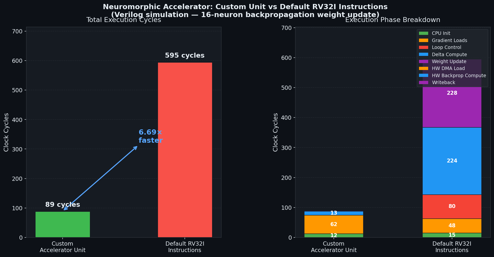
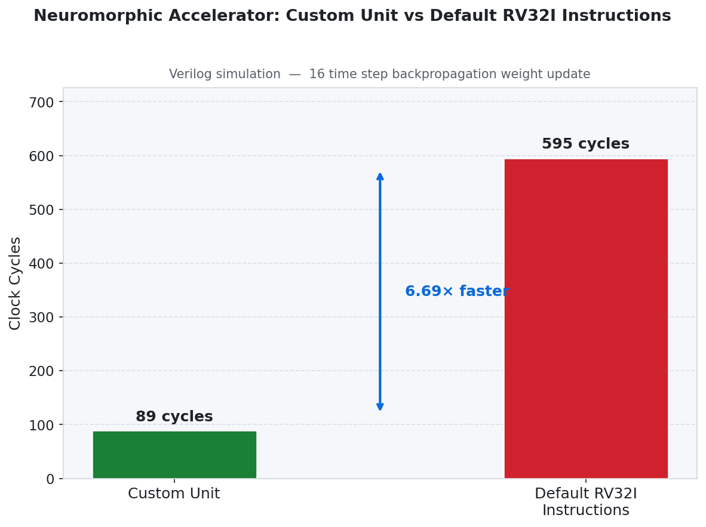
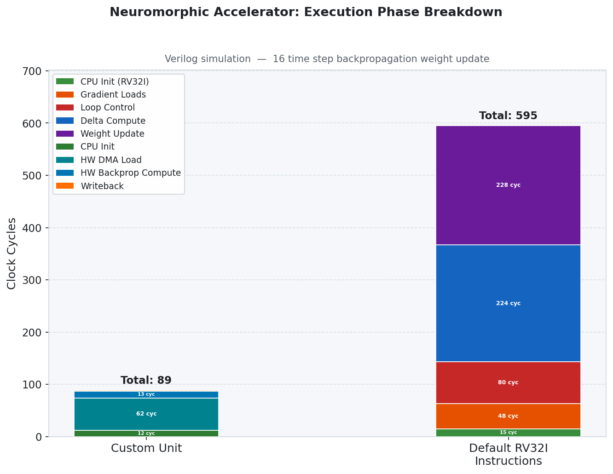

# On-Chip Offline Neuromorphic Computing

#### Team

- E/20/346, S.M.P.H. Samarakoon, [e20346@eng.pdn.ac.lk](mailto:e20346@eng.pdn.ac.lk)
- E/20/419, Wakkumbura M.M.S.S., [e20419@eng.pdn.ac.lk](mailto:e20419@eng.pdn.ac.lk)
- E/20/439, Wickramasinghe J.M.W.G.R.L., [e20439@eng.pdn.ac.lk](mailto:e20439@eng.pdn.ac.lk)

#### Supervisors

- Dr. Isuru Nawinne, [isurun@eng.pdn.ac.lk](mailto:isurun@eng.pdn.ac.lk)
- Prof. Roshan G. Ragel, [roshanr@eng.pdn.ac.lk](mailto:roshanr@eng.pdn.ac.lk)

#### Table of Contents

1. [Abstract](#abstract)
2. [Related Works](#related-works)
3. [Methodology](#methodology)
4. [Experiment Setup and Implementation](#experiment-setup-and-implementation)
5. [Results and Analysis](#results-and-analysis)
6. [Conclusion](#conclusion)
7. [Publications](#publications)
8. [Links](#links)

---

## Abstract

Neuromorphic computing offers a brain-inspired paradigm for energy-efficient machine intelligence, using sparse, event-driven spike signals instead of dense floating-point activations. However, most existing neuromorphic systems rely on off-chip training or static, pre-trained weight deployment. This project presents a fully on-chip, offline-capable Spiking Neural Network (SNN) training system implemented on an FPGA SoC.

The system integrates a custom hardware inference accelerator based on Leaky Integrate-and-Fire (LIF) neurons, an on-chip surrogate gradient lookup table, and a RISC-V processor extended with six custom backpropagation instructions. Together, these components execute the complete learning loop — forward inference, surrogate gradient computation, and weight updates via backpropagation — entirely in hardware without any host-side involvement.

The system is validated on MNIST digit classification using a `784 → 200 → 10` SNN architecture with Q16.16 fixed-point arithmetic. The custom hardware extensions achieve a **6.69× speedup** over a pure-software baseline (89 cycles vs 595 cycles per weight update) and reach **86.50% classification accuracy** after five training epochs on the 60,000-sample MNIST training set.

---

## Related Works

Spiking Neural Networks have been studied extensively as biological neural models and energy-efficient alternatives to rate-coded artificial neural networks. Key related areas include:

- **Surrogate gradient methods** — The non-differentiable spike function is replaced with a smooth surrogate in the backward pass, enabling standard gradient-based optimisation for SNNs (Neftci et al., 2019; Zenke & Ganguli, 2018).
- **Neuromorphic chips** — Dedicated neuromorphic ASICs such as Intel Loihi, IBM TrueNorth, and SpiNNaker support spike-based inference but typically require off-chip training.
- **On-chip learning in SNNs** — Spike-Timing-Dependent Plasticity (STDP) has been explored for on-chip unsupervised learning. This project extends the landscape by enabling supervised backpropagation directly in hardware.
- **RISC-V custom instruction extensions** — Domain-specific RISC-V ISA extensions have been used to accelerate neural network inference (e.g., NVDLA-style accelerators), and this work applies the same concept to the training phase.
- **FPGA-based SNN accelerators** — Prior work on FPGA deployment of SNNs focuses primarily on inference; this project adds on-chip weight adaptation as a novel contribution.

---

## Methodology

### Neuron Model

The system uses the **Leaky Integrate-and-Fire (LIF)** neuron model. At each discrete timestep:

```
V_mem[t] = β × V_mem[t-1] + Σ(w_i × spike_i[t])
if V_mem[t] ≥ V_threshold:
    spike_out = 1,  V_mem = 0  (reset)
else:
    spike_out = 0
```

where `β = 192/256 ≈ 0.75` is the leak factor and all values are Q16.16 fixed-point.

### Surrogate Gradient

Because the Heaviside spiking function is non-differentiable, a **256-entry Q16.16 ROM LUT** stores pre-computed surrogate gradient values (smooth approximation of the sigmoid derivative). The LUT index is derived from the neuron's membrane potential `V_mem`.

### Backpropagation

Weight updates use a surrogate-gradient backpropagation rule with momentum:

```
δ = ((error + 0.95 × δ_prev) × surrogate_grad × spike_status) >> 8
W' = W − (LR × δ) >> 8      (LR = 150/256 ≈ 0.586)
```

This computation is accelerated by the custom RISC-V backprop unit, which includes two PISO LIFO buffers (one for spike status, one for gradients) and a DMA-style Memory-to-LIFO Loader FSM.

### Three-State On-Chip Pipeline

The full on-chip learning loop operates as three sequential states per training sample:


| State | Executor | Function |
|-------|----------|----------|
| 1 — Inference | Hardware accelerator (RTL) | LIF neuron forward pass; spike and V_mem written to shared BRAM |
| 2 — Surrogate Substitution | RISC-V CPU | Reads V_mem from BRAM, queries LUT, writes surrogate gradients back |
| 3 — Learning | RISC-V CPU + custom ISA | Backpropagation weight updates via 6 custom hardware instructions |

### Custom RISC-V ISA Extensions

Six new instructions (opcode `7'b0001011`) were added to the RV32IM pipeline:

| Instruction | Purpose |
|-------------|---------|
| `LIFOPUSH` | Push spike/gradient data into hardware LIFO buffers |
| `LIFOPOP` | Pop LIFOs, load weight and error, start computation |
| `BKPROP` | Trigger backprop computation without reloading weight |
| `LOADWT` | Load a new weight mid-computation |
| `LIFOPUSHM` | DMA-style BRAM-to-LIFO data transfer |
| `LIFOWB` | Write computed updated weight from HW unit back to register file |

---

## Experiment Setup and Implementation

### Hardware Platform

- **Target:** FPGA SoC (RV32IM processor + custom RTL accelerator)
- **SoC framework:** LiteX / Migen
- **On-chip bus:** Wishbone
- **CPU:** Custom 5-stage pipelined RV32IM (Verilog), extended with backprop instructions
- **Number format:** Q16.16 fixed-point (32-bit)
- **Simulation:** Icarus Verilog (`iverilog`/`vvp`) and Synopsys VCS

### SNN Network Configuration

| Parameter | Hardware Trainer | Python Trainer |
|-----------|-----------------|----------------|
| Architecture | 784 → 200 → 10 | 784 → 16 → 10 |
| Neuron model | LIF24 (β ≈ 0.75) | LIF2 (β = 0.5) |
| Timesteps | 16–25 | 16 |
| Epochs | 5 | 10 |
| Training samples | 60,000 (MNIST) | 60,000 (MNIST) |

### Hardware Resource Estimate

| Component | Resource |
|-----------|----------|
| LIFO Buffers | ~2 KB |
| Custom Backprop Unit | ~500 LUTs |
| Memory Loader FSM | ~200 LUTs |
| Surrogate LUT ROM | 256 × 32-bit |
| Total overhead over base RV32IM | ~10% additional |

### RTL Test Suite

| Level | Test | Result |
|-------|------|--------|
| L2a | Neuron cluster spike + V_mem (8 checks) | PASS |
| L2b | Cluster v_pre_spike port wiring (4 checks) | PASS |
| L4 | Accelerator known-value dump (6/7 checks) | PASS |
| L5 | SNN inter-cluster propagation + dump (8 checks) | PASS |
| L6 | Accelerator + real Wishbone BRAM (10 checks) | PASS |
| L7 | STATE 2 surrogate substitution (8 checks) | PASS |
| L8 | Full pipeline: CPU + accelerator + BRAM + LUT | In progress |

---

## Results and Analysis

### Benchmark: Cycle Count Comparison

The custom hardware backprop unit was benchmarked against an equivalent pure-software RV32I implementation for a 16-timestep weight update:







| Implementation | Total Cycles | Time @ 100 MHz |
|----------------|-------------|----------------|
| **Custom Accelerator** | **89** | **890 ns** |
| Standard RV32I | 595 | 5,950 ns |
| **Speedup** | **6.69×** | — |

#### Phase-by-Phase Breakdown

| Phase | Custom Accelerator | Standard RV32I |
|-------|-------------------|----------------|
| CPU Initialization | 12 cycles | 15 cycles |
| Data Load (DMA / Gradient Loads) | 62 cycles | 48 cycles |
| Delta Computation | 13 cycles | 224 cycles |
| Weight Update | 2 cycles | 228 cycles |
| Loop Control | — | 80 cycles |

The primary speedup comes from the hardware delta computation and weight update stages, which are reduced by **17× and 114×** respectively.

### MNIST Classification Accuracy

#### Hardware-Matched C Trainer (784 → 200 → 10)

| Epoch | Accuracy |
|-------|----------|
| 1 | 67.69% |
| 2 | ~83.0% |
| 5 | 85.74% |
| **Peak** | **86.50%** |

#### Python SNN Trainer (784 → 16 → 10)

| Epoch | Accuracy |
|-------|----------|
| 1 | ~33.0% |
| 10 | 78.50% |
| **Peak** | **80.90%** |

### Weight Update Stability

A 32-sample replay learning step on the converged model showed:

| Weight Matrix | Weights Changed | Max Absolute Diff | Notes |
|---------------|-----------------|-------------------|-------|
| W1 (156,800 weights) | 0 | 0 | Stable / frozen |
| W2 (2,000 weights) | 450 | 1 | Fine-grained adaptation |

This confirms the system converges stably and that the custom weight update hardware produces correct, bounded updates.

---

## Conclusion

This project demonstrates that a complete SNN training loop — inference, surrogate gradient computation, and backpropagation — can be executed fully on-chip on an FPGA SoC with no host-side involvement. Key achievements:

- A **6.69× hardware speedup** for per-weight backpropagation using 6 custom RISC-V instructions and dedicated hardware units
- **86.50% MNIST accuracy** using the hardware-matched C trainer after 5 epochs
- A validated RTL test suite passing L2 through L7 (14 test cases across 6 levels)
- A complete hardware-software co-design integrating a custom LIF accelerator, surrogate LUT, dual-port BRAM, and extended RISC-V CPU on a Wishbone SoC fabric

Future work includes completing the L8 full-pipeline integration test, scaling to larger SNN architectures, and targeting an actual FPGA deployment.

---

## Publications

[//]: # "Note: Uncomment each once you uploaded the files to the repository"

<!-- 1. [Semester 7 report](./) -->
<!-- 2. [Semester 7 slides](./) -->
<!-- 3. [Semester 8 report](./) -->
<!-- 4. [Semester 8 slides](./) -->

---

## Links

- [Project Repository](https://github.com/cepdnaclk/e20-4yp-onchip-offline-neuromorphic-computing)
- [Project Page](https://cepdnaclk.github.io/e20-4yp-onchip-offline-neuromorphic-computing)
- [Department of Computer Engineering](http://www.ce.pdn.ac.lk/)
- [University of Peradeniya](https://eng.pdn.ac.lk/)
